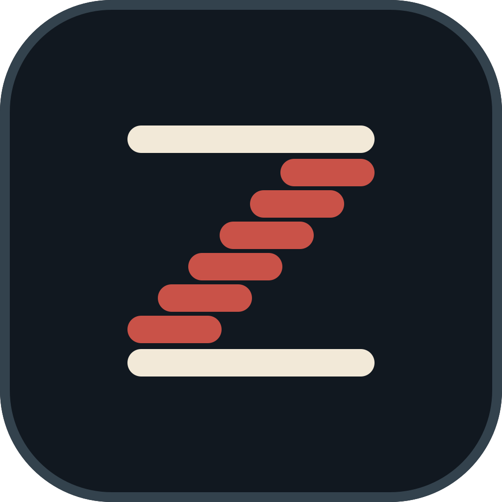
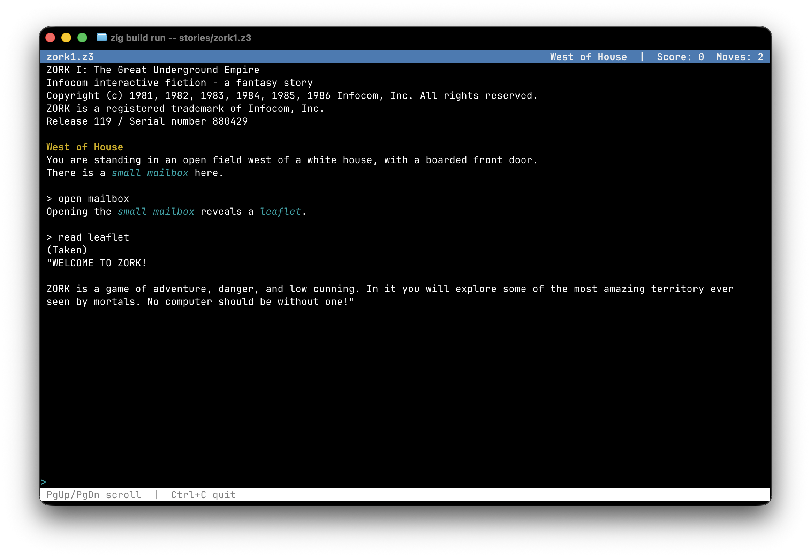
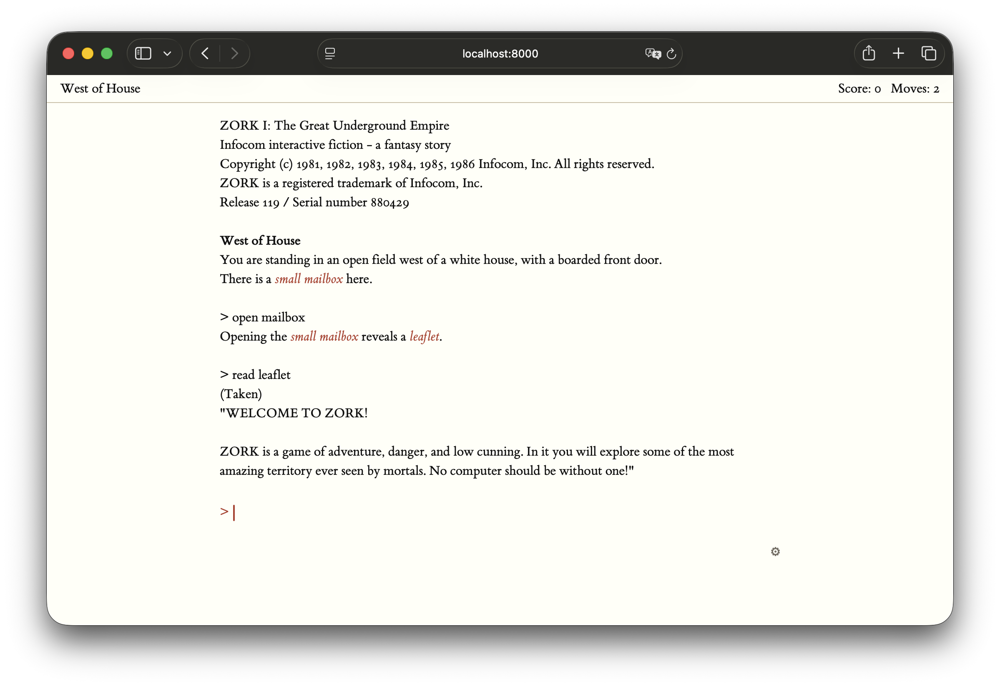

# Z기계 · z-gigye

[](https://github.com/swilcox/zgigye/actions/workflows/pages.yml)
[](LICENSE)

A z-machine interpreter in Zig, targeting version 3 (`.z3`) story files.

## ▶ [Play it live in your browser → **swilcox.github.io/zgigye**](https://swilcox.github.io/zgigye/)

No install, no download, nothing to run — the entire interpreter is compiled to
WebAssembly and plays a story (Zork I) **right in the browser**, all on the
client. Type `open mailbox` and go. Prefer the terminal? Read on.

---



The full-screen TUI playing Zork I: the current location (*West of House*)
in bold yellow and other object names (*small mailbox*, *leaflet*) in cyan
italic, with the title bar showing the story name, location, score, and moves.
`--theme` also offers `mono` and `c64`.

The same interpreter, same story, compiled to WebAssembly and running in the
browser under the web-only `tufte` theme — cream page, ET Book, and a single
muted red for the object names:



## The name

**Z기계** — *z-gigye*, run together as `zgigye` wherever a name has to be one
word. 기계 (*gigye*, roughly *kee-gyeh*) is Korean for "machine", from the
hanja 機械: 機 a device or mechanism, 械 a tool. So the name is just
"z-machine" with the second half in Hangul — which is apt for a program
whose entire job is decoding one alphabet into another.

The brandmark above takes the other half of the name: a **Z** built out of the
transcript it is reading — two cream lines of prose with a red stair descending
between them, which is what an interpreter walking a story file amounts to. 기계
itself sits in the wordmark, where there is room to read it. The mark files, the
palette, and which one to use where are in [docs/assets](docs/assets/).

## Build and run

Requires Zig 0.16.

```sh
zig build                                # builds zig-out/bin/zgigye
zig build run -- stories/zork1.z3        # play a story (full-screen TUI)
zig build serve -- stories/zork1.z3      # play in a browser (demo web server)
zig build wasm                           # builds zig-out/bin/zgigye.wasm
zig build web                            # stages the wasm demo under zig-out/web/
zig build test                           # unit + integration tests
```

The `web` target stages everything the browser demo needs as static files,
so it needs no server of ours — serve `zig-out/web/` with anything:

```sh
zig build web && (cd zig-out/web && python3 -m http.server)
```

When attached to a terminal the interpreter runs a full-screen TUI (built
on [libvaxis](https://github.com/rockorager/libvaxis)): a title bar with
the story name and live status (location, score/moves or time), a
word-wrapped scrolling transcript (PgUp/PgDn), an input line, and a footer
with key hints. `--theme <name>` picks the colour theme (`default`, `mono`,
or `c64`). With `--plain`, or whenever stdin/stdout is not a terminal, it
falls back to plain text — so piping commands in keeps working.

## Architecture

The core never touches files or terminals; everything flows through small,
testable layers:

| File | Responsibility |
|------|----------------|
| `src/memory.zig` | Byte-addressed memory, big-endian words, dynamic/static write guard |
| `src/header.zig` | Story file header parsing |
| `src/zscii.zig` | Z-string decoding and dictionary-word encoding (spec ch. 3) |
| `src/instruction.zig` | Side-effect-free instruction decoder (spec ch. 4) |
| `src/objects.zig` | Object tree, attributes, properties (spec ch. 12) |
| `src/dictionary.zig` | Dictionary lookup and input tokenisation (spec ch. 13) |
| `src/machine.zig` | Call frames, evaluation stack, variables, the run loop |
| `src/opcodes.zig` | The v3 instruction set, one switch (spec ch. 14-15) |
| `src/ui.zig` | The frontend interface (`Ui` vtable) |
| `src/highlight.zig` | Span model for object-name highlighting (marked at `print_obj`) |
| `src/debug.zig` | `$`-prefixed debugging commands that inspect machine state |
| `src/state.zig` | Out-of-band machine-state snapshots (compact byte blobs) |
| `src/session.zig` | Suspend-at-input/resume driver for non-blocking frontends |
| `src/turn_json.zig` | The JSON wire format for a turn, shared by both web frontends |
| `src/text_ui.zig` | Plain-text frontend over any `std.Io` reader/writer pair |
| `src/tui_ui.zig` | Full-screen libvaxis frontend (exe only, not in the library) |
| `src/theme.zig` | TUI colour themes: a `vaxis.Style` per styled element (exe only) |
| `src/main.zig` | CLI entry point; picks the frontend and wires it up |
| `src/serve.zig` | Demo HTTP frontend, one request per turn (exe only) |
| `src/wasm.zig` | WebAssembly frontend, one exported call per turn (exe only) |
| `src/web/page.html` | The play page, shared by both web frontends |

### Pluggable frontends

`Ui` is a vtable interface with four operations: `print`, `printObject`,
`readLine`, and `showStatus`, each returning the explicit `Ui.Error` set
rather than `anyerror` — so `error.InputPending`, which the whole
suspend/resume protocol turns on, is part of the declared interface and
checked by the compiler. Status-line data is passed structured (location object name
plus score/turns or time), so each frontend renders it natively. Two
implementations exist: `TextUi` (plain text over generic `std.Io` streams,
used for piped play and all tests) and `TuiUi` (full-screen libvaxis).
The core library has no dependency on libvaxis; only the executable does.

### Highlighting

Rich frontends mark up the transcript: the current location in **bold**
and other object names (e.g. *small mailbox*) in *italics*. Highlighting
is decided at print time — when the game runs the `print_obj` opcode the
core tags that text as an object name (location if it is the current
location in global 0, keyword otherwise) and passes it through
`Ui.printObject`. So only the names the game actually prints *as objects*
are marked, never a word that merely appears in a room description.
Frontends collect those marks over a turn and render them their own way;
`src/highlight.zig` holds the span types and assembles the flat span list
(`spansFromMarks`). Both highlights default to on: the TUI takes
`--no-highlight-location` / `--no-highlight-keywords`, and the web pages
(both the HTTP demo and the WebAssembly build) hide two checkboxes and a
theme picker behind a gear icon, all persisted in localStorage. Plain-text
mode never styles anything.

In the TUI the actual colours and attributes come from the theme (see
`src/theme.zig`): the `default` theme renders the location bold yellow and
other object names cyan italic, plus styling for the title bar, footer,
and prompt. A theme is a `vaxis.Style` per element, so it can set any
foreground/background colour and attribute (bold, italic, underline, ...);
`--theme <name>` selects one (`default`, `mono` — a colourless fallback, or
`c64` — light blue on the classic dark blue Commodore 64 screen). The web
pages mirror the same three themes in CSS variables, chosen from the gear
panel's theme picker.

### Debug commands

Any input line beginning with `$` is intercepted before it reaches the
parser and handled as a debugging command that peeks at machine state —
it never mutates the machine or advances the turn, and the prompt returns
for the next line. They work in every frontend (the report is printed
through the `Ui` like any other output). `src/debug.zig` is part of the
core library and, like the rest of it, touches no files or terminals.

| Command | Shows |
|---------|-------|
| `$help` | the list of commands |
| `$dump` | the program counter, call frames, and evaluation stack |
| `$dict` | the story's dictionary |
| `$tree` | the whole object tree |
| `$room` | the sub-tree of the current location |
| `$you` | the sub-tree of the player object |
| `$object num`/`name` | an object's sub-tree |
| `$attrs num`/`name` | an object's set attribute flags |
| `$props num`/`name` | an object's properties |
| `$find name` | object numbers whose name matches |
| `$header` | the story header fields |

### Suspend/resume and the web frontend

A frontend that cannot block on input (a web server answering one HTTP
request per game turn) returns `error.InputPending` from `readLine`; the
machine rewinds to the read instruction and unwinds out of `run`, at which
point `Machine.saveState` captures all mutable state — dynamic memory
(XOR-diffed against the story and run-length encoded, typically well under
1 KB), call frames, evaluation stack, PC, and RNG — as a compact blob.
`Machine.loadState` applies a blob to a fresh machine for the same story,
validating every field of the untrusted input first.

`src/session.zig` wraps this as a pure turn-at-a-time API: `start(story)`
runs to the first prompt; `advance(story, blob, input)` applies one
command and runs to the next. Each `Turn` carries the printed output,
structured status-line data, and the next state blob (or null once the
game ends). Where blobs are persisted is entirely the caller's business —
`zig build serve` demonstrates the extreme: a stateless HTTP server that
round-trips the blob through the browser as base64. `src/wasm.zig` drives
the same `session` API from inside the browser instead: compiled to
`wasm32-freestanding`, it exports one call per turn and hands the JSON
straight to the page, so the round-trip never leaves the client.

Beyond that transport, the two are the same program. `src/turn_json.zig`
owns the JSON a turn is reported as, so both emit identical bytes by
construction rather than by two definitions being kept in step. They serve
one page, `src/web/page.html`; the only file that differs is the one
served as `transport.js` — `transport_http.js` does a `fetch` per turn,
`transport_wasm.js` calls into the module — and both define the same
`Transport` of `init`, `start`, and `advance`.

### Testing

Every module carries unit tests. Integration tests in
`src/integration_test.zig` run real stories embedded from `src/testdata/`:

- `czech.z3` — the Comprehensive Z-machine Emulation CHecker; runs with no
  input and must report `Passed: 349, Failed: 0`.
- `zork1.z3` — a scripted play session, checked against a golden
  transcript in `src/testdata/`, so a behavioural change shows up as a
  readable diff rather than a pass count.

czech is the broad check on the instruction set, but it reports only a
total: a regression there says nothing about *which* opcode broke. So
`src/test_machine.zig` provides a machine over a synthetic story and a
small assembler, letting `opcodes.zig` and `machine.zig` test one
instruction at a time — signedness, the indirect-stack rule, address
wraparound, call frames and local defaults.

A story file is untrusted input — it may be truncated, hand-edited, or
hostile — and so are the state blobs the web frontends round-trip through
the browser. Neither may crash the interpreter: every malformed input has
to come back as an error. `src/fuzz_test.zig` holds a target for each,
plus a seeded driver that runs both over a few thousand pseudo-random
corruptions on every `zig build test`. Coverage-guided runs
(`zig build test --fuzz`) await a fix to a type error in Zig 0.16.0's own
bundled test runner, which only affects fuzz builds.

Line coverage (requires `brew install kcov`):

```sh
zig build coverage
open zig-out/coverage/index.html   # per-file, per-line HTML report
```

The totals are also machine-readable in
`zig-out/coverage/*/coverage.json`. Coverage measures the core library's
test run; the libvaxis frontend is excluded.

### Continuous integration

`.github/workflows/ci.yml` runs the formatter check, the test suite, and a
build of every frontend on Linux and macOS. It runs on pull requests, and
the Pages workflow calls it before deploying, so a push that breaks the
interpreter never reaches the live demo.

## Not yet implemented

- In-band save/restore (Quetzal) — the save/restore opcodes currently
  branch as failed. (Out-of-band snapshots exist; see `src/state.zig`.)
- Versions other than 3.
- Sound, screen splitting, and output streams beyond the main window.

## Releases

Versions are tagged `vMAJOR.MINOR.PATCH`; see [CHANGELOG.md](CHANGELOG.md).
While the major version is 0 the library API may change in any minor
release.

## License

zgigye is MIT-licensed; see [LICENSE](LICENSE).

It builds against libvaxis (MIT) and embeds the ET Book fonts (MIT) in the
web frontends — see [THIRD-PARTY.md](THIRD-PARTY.md). The two bundled story
files are separate works with terms of their own, set out in
[stories/README.md](stories/README.md); both are free to redistribute.
`czech.z3` is freely distributable by its authors, and `zork1.z3` is the
compiled story file from
[`historicalsource/zork1`](https://github.com/historicalsource/zork1),
which the rightsholder published under an MIT license.
